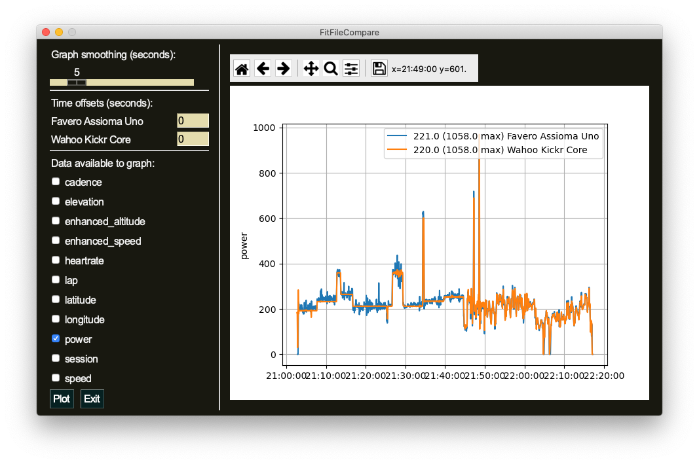

# README

This is a GUI application written in Python to compare [FIT](https://fileinfo.com/extension/fit) files. The application plots data from a single or multiple FIT files. You are also able to compare the different FIT files, which might be useful in some cases.

## Usage

When you open the app you will be able to load one or more files from the file browser. If you want to select multiple FIT files, please hold the ctrl key on Windows or the cmd key on macOS while clicking on the files.

In the next window you can rename your files to something more convenient. This name will be included in the legends of the plots, so I suggest you choose reasonably short names.

In the main graphing window you can set a smoothing value in the top left corner by dragging the slider. This smoothes the data by calculating the rolling average over the period you choose in seconds.
You are also able to set time offsets for the files. Please input an integer (positive or negative) to shift the data. *TODO: there is currently a bug where the offsets are accumulated each time you press "Plot".*

In the lower left hand corner you choose which data fields you want to plot. After pressing the **Plot** button, you can zoom and navigate in the plots using the controls above the figure(s).